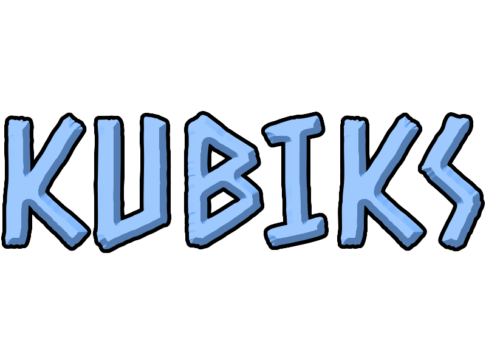

<p align="center">
    
</p>
<h4 align="center">Простой и удобный язык конфигурации для Python.</h4>

[](https://opensource.org/licenses/MIT)

🇺🇸 [English](README.en.md) | 🇷🇺 [**Русский**](README.ru.md)


# Почему стоит использовать Kubiks?

**Kubiks** — это лёгкий и читаемый формат конфигурационных файлов для Python.

Он был создан как более удобная альтернатива JSON для случаев, когда конфигурацию приходится редактировать вручную. Синтаксис остаётся простым, но при этом поддерживает вложенные структуры, списки, проценты, комментарии и другие полезные возможности.

### Преимущества

* ✨ Читаемый синтаксис
* 📦 Поддержка вложенных словарей и списков
* 💬 Комментарии прямо в файле
* 📊 Проценты автоматически преобразуются в числа
* 🔢 Поддержка целых и дробных чисел
* ✅ Логические значения (`true` / `false`)
* ⭕ Значение `null`
* 🐍 Простая загрузка в Python

Например, такой файл:

```kbk
player |= {
    username |= "KubikNoLego"
    level |= 42
    premium |= true
    win_rate |= 67%
}
```

После загрузки превратится в обычный Python-словарь:

```python
{
    "player": {
        "username": "KubikNoLego",
        "level": 42,
        "premium": True,
        "win_rate": 0.67
    }
}
```

# Загрузка файла

```python
from kubiks import load

config = load("config.kbk")
```

После загрузки функция возвращает обычный словарь Python, который можно использовать как угодно.

# Как писать файлы `.kbk`

Все данные записываются в формате **ключ-значение**.

Для присваивания используется оператор `|=`:

```kbk
name |= "Кубик"
```

После загрузки:

```python
{
    "name": "Кубик"
}
```

# Типы данных

## Строки

Kubiks:

```kbk
name |= "Кубик"
```

Python:

```python
{
    "name": "Кубик"
}
```

---

## Null

Kubiks:

```kbk
title |= null
```

Python:

```python
{
    "title": None
}
```

---

## Целые числа

Kubiks:

```kbk
some_number |= -20
```

Python:

```python
{
    "some_number": -20
}
```

---

## Числа с плавающей точкой

Kubiks:

```kbk
price |= 19.99
```

Python:

```python
{
    "price": 19.99
}
```

---

## Логические значения

Kubiks:

```kbk
enabled |= true
admin |= false
```

Python:

```python
{
    "enabled": True,
    "admin": False
}
```

---

## Проценты

Kubiks:

```kbk
win_rate |= 67%
tax |= 20%
```

Python:

```python
{
    "win_rate": 0.67,
    "tax": 0.2
}
```

Проценты автоматически преобразуются в дробные значения.

---

# Списки

Kubiks:

```kbk
inventory |= [
    "wooden_sword",
    "iron_pickaxe",
    "golden_apple"
]
```

Python:

```python
{
    "inventory": [
        "wooden_sword",
        "iron_pickaxe",
        "golden_apple"
    ]
}
```

---

# Объекты

Kubiks поддерживает вложенные структуры любой глубины.

```kbk
user |= {
    username |= "KubikNoLego"

    statistics |= {
        games_played |= 156
        games_won |= 104
    }
}
```

Python:

```python
{
    "user": {
        "username": "KubikNoLego",
        "statistics": {
            "games_played": 156,
            "games_won": 104
        }
    }
}
```

---

# Комментарии

Комментарии начинаются с символа `#`.

```kbk
# User settings
theme |= "dark"

# Enable notifications
notifications |= true
```

Комментарии игнорируются при загрузке файла.

---

# Лицензия

Проект распространяется под лицензией MIT.
